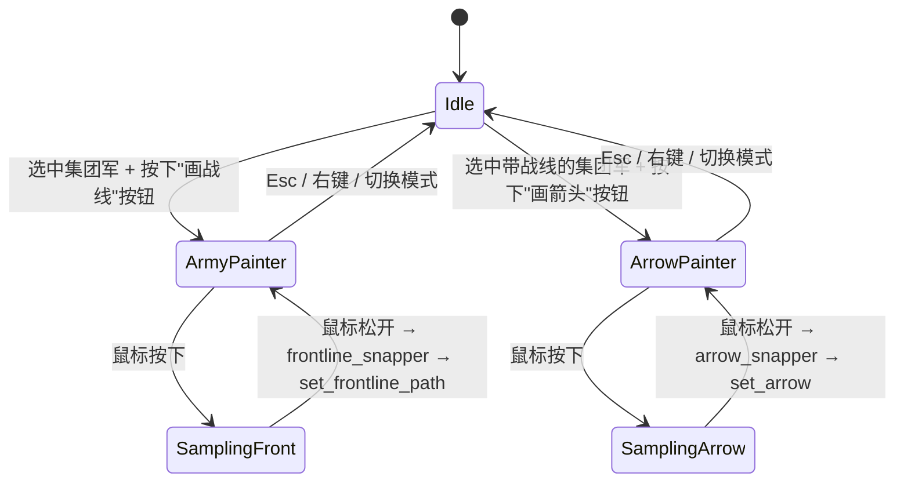

# 设计文档：玩家划线战线（frontline-orders）

## 概览

本特性把"玩家在地图上画线 → 一支命名集团军沿线展开 → 可叠加进攻箭头沿线推进"这一交互引入引擎，并把同一套机制让 AI 复用。设计目标按重要性排序：

1. **纯函数核心**（吸附器 + 分布器）可以脱离 `World` 写属性测试；与现有 `compute_segment` / `daily_movement_tick` / `can_enter_province` / `next_step` 形成清晰分层。（_R11、属性 A/B/C/J/K_）
2. **指令是状态**：战线指令存在 `World.player_armies` 上，由存档 round-trip。AI 与玩家共享同一容器，仅以 `PlayerArmy.owner` 区分。（_R1、R10、R12、R15.1、R15.10、属性 E/F_）
3. **复用现有循环**：分布器只写 `divisions.destinations[i]`，让 `daily_movement_tick` / `daily_occupation_tick` 接管真实位移与战斗阻挡；不引入第二条移动管线。（_R3.6、R4.2、R4.5_）
4. **AI override 互锁**：通过 `World.player_locked_divisions: HashSet<usize>`，让 `execute_ground_orders` 跳过被战线指令托管的师，让 AI 改师只能走战线 API。（_R8、R15.4、属性 G_）
5. **渲染只读地、可关闭**：UI/绘制只读 `world.player_armies`，每帧把战线 + 箭头转换成 `ArrowInstance` 提交给现有 `MapArrowPass`，不新增 GPU pipeline。（_R9、R13.3_）

设计**不**做的事：
- 不实现新的 BFS 实现——复用 `crates/hoi4-logic/src/military/movement.rs::next_step` 中已经存在的 40 跳陆地 BFS 与 `find_friendly_retreat`。
- 不改写 `Army`/`Corps`/`ArmyGroup`（`hoi4-state::command`）——它们是 OOB 自动分组结构，与"玩家划线 Army"语义不同，避免破坏 CR-3。`PlayerArmy` 是新类型。
- 不动 `daily_movement_tick` 的战斗阻挡逻辑——攻防交战完全继承既有行为。

## 架构

### 模块放置

| Crate | 模块 | 职责 |
|---|---|---|
| `hoi4-state` | `state::command` 同级新增 `state::frontline`（即 `crates/hoi4-state/src/frontline.rs`） | 纯数据：`ArmyId`、`PlayerArmy`、`FrontlineOrder`、`OffensiveArrow`。无算法。 |
| `hoi4-state` | `world::World` 字段 | `player_armies: Vec<PlayerArmy>`、`player_locked_divisions: HashSet<usize>`、`next_army_id: u32`（单调递增分配 `ArmyId`）。 |
| `hoi4-state` | `save::text` / `save::binary` | 扩展序列化覆盖 `player_armies`。 |
| `hoi4-logic` | `military::frontline`（新模块 `crates/hoi4-logic/src/military/frontline.rs`） | **纯**算法：`frontline_snapper`、`frontline_distributor`、`pick_arrow_executors`、`validate_path`、daily 重算入口 `tick_frontlines`。无 I/O、无 RNG、无全局状态。 |
| `hoi4-logic` | `military::frontline::api` 子模块 | 公共 API：`create_army` / `dissolve_army` / `add_members` / `remove_members` / `set_frontline_path` / `clear_frontline_path` / `set_arrow` / `clear_arrow`，统一供玩家 UI 与 AI 调用。 |
| `hoi4-ai` | `ground_orders` | 添加"成员锁"过滤：`world.player_locked_divisions` 中的师跳过；玩家国家若拥有任何活跃 `PlayerArmy`，整个 `execute_ground_orders` 对其变为 no-op；AI 国家自身的 `PlayerArmy` 成员同样被跳过（兜底逐师路径不能改它们）。 |
| `hoi4-ai` | 新增 `frontline_ai` 模块或扩展 `ground_orders` | `tick_ai_frontlines(world, country)`：按 `compute_segment` 输出，调战线 API 创建/重画/解散 AI 集团军。（_R15.3_） |
| `hoi4-app` | `main.rs` 的 `App` 结构 | `frontline_painter: FrontlinePainterState`（鼠标采样、当前模式、当前选中 ArmyId、预览路径）。UI 控件（创建/解散集团军、加入/移除师、取消箭头、显示叠加层 toggle）通过 `hoi4_ui` 现有面板风格暴露。 |
| `hoi4-app` | `passes::maparrow` 调用方 | 每帧由 `App::collect_frontline_arrows()` 把 `world.player_armies` 与（可选）当前预览路径转成 `Vec<ArrowInstance>`，随 mock 数据替换路径调用 `MapArrowPass::set_arrows`。 |

### 调用关系

```mermaid
flowchart TD
    UI[App: Army_Painter / Arrow_Painter] --> API[hoi4_logic::military::frontline::api]
    AI[hoi4_ai::frontline_ai::tick] --> API
    API --> Snap[frontline_snapper]
    API --> Dist[frontline_distributor]
    API --> State[(World.player_armies)]
    Daily[systems.rs military_daily] --> TickF[military::frontline::tick_frontlines]
    TickF --> Validate[validate_path]
    TickF --> Dist
    TickF --> Arrow[pick_arrow_executors]
    TickF --> Lock[update player_locked_divisions]
    TickF --> Dest[(divisions.destinations[i])]
    Daily --> Move[movement::daily_movement_tick]
    Move --> Dest
    Daily --> AIRun[ai_daily orchestrator]
    AIRun --> EGO[execute_ground_orders]
    EGO -->|跳过 player_locked_divisions| Dest
    Render[App render] --> Read[(world.player_armies, player_locked_divisions)]
    Render --> ArrowPass[MapArrowPass.set_arrows]
```

### 每日 tick 集成顺序（关键）

`military_daily` 必须按下面的顺序执行（_R3.7、R7.1、R7.2、R7.3、R8.1、属性 H_）：

```text
military_daily(ctx):
  1. organisation::tick_daily(world)
  2. frontline::tick_frontlines(world)              ← 新增
       ├─ for each PlayerArmy a with active order:
       │    a) validate_path(world, a)
       │       drop provinces in path[] whose controller is not player_country
       │       nor co-belligerent, or that have no enemy-adjacent land neighbour
       │    b) if path.is_empty(): mark order inactive, emit "前线已崩溃",
       │       continue to next army
       │    c) compute distribution = frontline_distributor(world, a)
       │    d) if a.order.arrow.is_some():
       │         executors = pick_arrow_executors(world, a)
       │         distribution.override(executors → next un-conquered arrow prov)
       │    e) for each (div_idx, target_prov) in distribution:
       │         if world.divisions.in_combat[div_idx]: skip   (_R3.8_)
       │         if is_broken(div_idx): skip                   (_R4.5_)
       │         if locations[div_idx] == target_prov:
       │             destinations[div_idx] = None
       │         else:
       │             destinations[div_idx] = Some(target_prov)
       │    f) if a.order.arrow.is_some() and every arrow prov is player-controlled:
       │         clear arrow, emit "箭头已完成"          (_R6.5_)
       │    g) drop members whose div idx is out of range or destroyed (_R1.7_)
       └─ rebuild world.player_locked_divisions from all active armies
  3. ai_daily(ctx) → orchestrator.tick:
       - For AI countries, frontline_ai::tick_ai_frontlines(world, country)
         BEFORE execute_ground_orders.                 (_R15.3_)
       - execute_ground_orders skips player_locked_divisions; if player_country
         owns ≥1 active army, the player branch is short-circuited entirely.  (_R8.1, R8.4_)
  4. movement::daily_movement_tick(world)
  5. movement::daily_occupation_tick(world)
```

### AI 集成（_R15_）

`hoi4_ai::frontline_ai::tick_ai_frontlines(world, country)` 是 AI 的"集团军决策器"：

1. 读 `compute_segment(world, country, enemy)` 对每个交战敌国得到 `FrontSegment`。
2. 对该国当前 `PlayerArmy`（owner == country）：
   - 已存在的：调用 `set_frontline_path` 把路径重画为该 segment 的 `friendly_states` 链（按 BFS 距离串成省 id 序列）；不重建集团军、不打乱成员。
   - 不存在的：对每个 active segment 调用 `create_army`，把当前在该 segment 范围内的师作为初始成员；调 `set_frontline_path`。
   - 受 `MAX_FRONTLINES_PER_COUNTRY = 4` 限制（_R15.2、属性 K_）；超出时跳过该 segment（保留旧的）。
3. 根据 `eval.decisions[seg].posture`：
   - `Attack` → `set_arrow(army, pick_attack_targets(world, country, seg))`。（_R15.3_）
   - `Defend / Hold / Retreat` → `clear_arrow(army)`。
4. `!front.has_front()` 但仍 `is_at_war` → 跳过本国集团军决策，让 `execute_mop_up_only` 走旧逐师追击（_R15.7_）。
5. AI 集团军成员被打废（`organisation/max_org < 0.05` 且 `strength < 0.05` 持续）→ 在第 5 步 (g) 清出；若集团军空了，`tick_ai_frontlines` 下个 tick 调 `dissolve_army`（_R15.11_）。

性能预算（_R15.8_）：每个 AI 国家每日 tick 内吸附器 + 分布器各最多调用一次，限 1 ms。

### UI 模式状态机（_R2、R5_）



采样率 ≥ 30 Hz（_R2.1_）；采样上限 1024 点（_R13.2_）；超出按时间窗等距下采。

## 组件与接口

### 1. `hoi4-state::frontline`（纯数据）

```rust
// crates/hoi4-state/src/frontline.rs
use crate::ids::{CountryId, ProvinceId};

#[repr(transparent)]
#[derive(Clone, Copy, PartialEq, Eq, Hash, Debug)]
pub struct ArmyId(pub u32);

impl ArmyId { pub const NONE: Self = Self(u32::MAX); }

#[derive(Clone, Debug, PartialEq)]
pub struct OffensiveArrow {
    /// 长度 ∈ [1, 32]，每对相邻省陆地相邻。
    pub provinces: Vec<ProvinceId>,
}

#[derive(Clone, Debug, PartialEq)]
pub struct FrontlineOrder {
    /// 有序、无重复，长度 ∈ [1, 64]，每对相邻省陆地相邻；运行时由 tick 维持合法性。
    pub path: Vec<ProvinceId>,
    pub arrow: Option<OffensiveArrow>,
    /// 锚点省：箭头第 1 省的相邻战线省。R6.6 易手时滚动选取。
    pub anchor: Option<ProvinceId>,
    /// 路径塌陷后置 false；R7.4 非战时也置 false 但保留 path。
    pub active: bool,
}

#[derive(Clone, Debug, PartialEq)]
pub struct PlayerArmy {
    pub id: ArmyId,
    pub name: String,
    pub owner: CountryId,
    /// DivisionStore 索引；不变量：每个下标至多在 1 个集团军中（属性 F）。
    pub members: Vec<usize>,
    pub order: Option<FrontlineOrder>,
}
```

`World` 字段补丁：

```rust
pub struct World {
    // ... existing ...
    pub player_armies: Vec<PlayerArmy>,
    pub player_locked_divisions: std::collections::HashSet<usize>,
    pub next_army_id: u32,            // 单调递增；解散不回收，保证 ArmyId 唯一性 (R1.1)
}
```

`World::new` 把这三项初始化为空 / 0。`World::populate_from_history` 不动它们。

### 2. `hoi4-logic::military::frontline`（纯算法）

```rust
// crates/hoi4-logic/src/military/frontline.rs
use hoi4_state::{
    frontline::{ArmyId, FrontlineOrder, OffensiveArrow, PlayerArmy},
    CountryId, ProvinceId, World,
};

pub const MAX_PATH_LEN: usize = 64;
pub const MAX_ARROW_LEN: usize = 32;
pub const MAX_FRONTLINES_PER_COUNTRY: usize = 4;
pub const MAX_BRIDGE_DEPTH: u32 = 6;
pub const MAX_SAMPLES: usize = 1024;

pub enum FrontlineError {
    NoSelectedDivisions,           // R14.1
    DivisionNotOwned,              // R1.2
    NoEligibleProvince,            // R2.6, R14.2
    AnchorNotAdjacent,             // R14.3
    BridgeUnreachable,             // R5.4, R14.4
    PathTruncated(usize),          // R2.5
    ArrowTruncated(usize),         // R5.3
    StaleMember(usize),            // R10.4
    ArmyCapReached,                // R15.2, 属性 K
    UnknownArmy,
}

// ─── 纯函数：吸附器 ───
pub fn frontline_snapper(
    world: &World,
    owner: CountryId,
    samples: &[ProvinceId],
) -> Result<Vec<ProvinceId>, FrontlineError>;

pub fn arrow_snapper(
    world: &World,
    owner: CountryId,
    anchor: ProvinceId,
    samples: &[ProvinceId],
) -> Result<Vec<ProvinceId>, FrontlineError>;

// ─── 纯函数：分布器 ───
/// 返回 (div_idx, target_prov) 列表。N < M 时漏掉的目标省不出现在结果中。
pub fn frontline_distributor(
    world: &World,
    army: &PlayerArmy,
) -> Vec<(usize, ProvinceId)>;

/// 取 ceil(N/2) 个进攻执行者，按到 anchor 的 BFS 距离升序，距离相同按 div_idx 升序。
pub fn pick_arrow_executors(
    world: &World,
    army: &PlayerArmy,
) -> Vec<usize>;

// ─── 验证（纯） ───
pub fn validate_path(world: &World, owner: CountryId, path: &[ProvinceId]) -> Vec<ProvinceId>;

// ─── 每日 tick ───
pub fn tick_frontlines(world: &mut World);
```

#### 2.1 `frontline_snapper` 算法

输入：`samples`（鼠标采样点对应的 `ProvinceId` 序列；同一省连续点先压缩）。

```text
1. 把 samples 投影到合法省：
   for s in samples:
     if eligible(s): keep
     else: skip            # R2.6 由调用方在 result 为空时判定
2. 去重连续相同省。
3. 缝合：对每对相邻 (a, b)，若 (a,b) 不在 world.map.adjacencies：
     bfs_land_path(a, b, max_depth=6)  # 复用与 next_step 同形 BFS
     若失败 → 在该缺口处截断（emit "无法连接"日志），保留前段。
4. 截断到 MAX_PATH_LEN；若被截断，emit FrontlineError::PathTruncated(orig_len)。
5. 校验 validate_path(world, owner, &path) == path（去掉 owner-flipped 等）。
6. 返回 path。

eligible(s) := is_land(s) ∧ controller(s) ∈ {owner, co_belligerent(owner)} ∧
               (∃ adj of s with controller hostile  OR  s 在两合法前线省的 BFS 桥上)
```

co-belligerent 判定（_术语表_）：

```text
co_belligerent(owner) := owner ∪
                        { c | faction_of(c) == faction_of(owner) ∧ at_war(c) } ∪
                        { c | has_military_access(owner, c) }
```

#### 2.2 `arrow_snapper` 算法

```text
1. 同 frontline_snapper 的步骤 1-3，但 eligibility 改为：
   eligible_arrow(s) := is_land(s) ∧ controller(s) hostile-to(owner)
2. 第 1 省必须与 anchor 陆地相邻；否则 → FrontlineError::AnchorNotAdjacent。
3. 截断到 MAX_ARROW_LEN；若被截断 → FrontlineError::ArrowTruncated(orig_len) (warn, 不丢)。
4. 缝合时 BFS 深度 ≤ MAX_BRIDGE_DEPTH=6；失败 → FrontlineError::BridgeUnreachable。
```

#### 2.3 `frontline_distributor` 算法（_R3、R11、属性 A/B/C/J_）

输入：`army.members`（活师下标列表）、`army.order.path`、`world.divisions.locations`、`world.map.adjacencies`、`world.provinces.controllers`。

```text
M = path.len()
N_alive = members.iter()
            .filter(|&i| i < world.divisions.count
                         && !is_broken(i)
                         && !world.divisions.in_combat[i])
            .copied()
            .collect::<Vec<_>>()
N = N_alive.len()
if N == 0 || M == 0: return []

if N < M:
    # 均匀挑 N 个目标省（下标 floor(j * M / N) for j in 0..N）— R3.4
    target_idxs = (0..N).map(|j| j * M / N).collect()
else:
    # 每省 floor(N/M) 或 ceil(N/M) — R3.2/R3.3
    base = N / M; extra = N % M
    capacity[j] = if j < extra { base + 1 } else { base }
    target_idxs = expand capacity into Vec<usize> of length N (each j repeated capacity[j] times)

# 把 N_alive 中每个师按 BFS 距离最近、次按 div_idx 升序映射到 target_idxs 槽 — R3.5
# 算法：
#   pairs = []
#   for &i in N_alive: for j in 0..M:
#       d = bfs_land_dist(world, locations[i], path[j], cap=40)
#       pairs.push((d, i, j))
#   sort pairs by (d asc, i asc, j asc)
#   greedily fill capacity[j] respecting target_idxs, each i exactly once
```

辅助：`bfs_land_dist` 与 `next_step` 同形（仅陆地省，深度上限 40），新增不带缓存 / 起终点对换可复用结果（属性 B/C 要求纯函数性）。**绝不写 `world.path_cache`**——`world: &World` 借用即可。

输出：`Vec<(div_idx, target_prov)>`，长度 ≤ N。剩余的 `members[i]`（破碎 / in_combat / 越界）不出现在输出里——daily tick 跳过它们而不重置 destination。

#### 2.4 `pick_arrow_executors` 算法（_R6.1、R6.2_）

```text
N = army.members.len() (非破碎、非 in_combat 的有效师)
K = ceil(N as f32 / 2.0) as usize
若 anchor 不在 path 中 → 选 BFS 最近的剩余 path 省作为新 anchor
                        （若 path 为空 → 清 arrow，调用方处理）— R6.6
按 (BFS_dist(loc, anchor), div_idx) 升序取前 K 个返回
```

被挑中的执行者，daily tick 把目的地设为 `arrow.provinces` 中**第一个**控制者非玩家国家的省份；其它师走 `frontline_distributor` 的防御分布。`can_enter_province` 假就跳过该执行者（保留分布器原结果）（_R6.4_）。

### 3. `hoi4-logic::military::frontline::api`（统一 API，玩家与 AI 共用）

```rust
pub fn create_army(
    world: &mut World,
    owner: CountryId,
    members: Vec<usize>,
    name: String,
) -> Result<ArmyId, FrontlineError>;

pub fn dissolve_army(world: &mut World, id: ArmyId) -> Result<(), FrontlineError>;

pub fn add_members(world: &mut World, id: ArmyId, members: &[usize]) -> Result<(), FrontlineError>;
pub fn remove_members(world: &mut World, id: ArmyId, members: &[usize]) -> Result<(), FrontlineError>;

pub fn set_frontline_path(
    world: &mut World,
    id: ArmyId,
    samples: &[ProvinceId],
) -> Result<(), FrontlineError>;

pub fn clear_frontline_path(world: &mut World, id: ArmyId) -> Result<(), FrontlineError>;

pub fn set_arrow(
    world: &mut World,
    id: ArmyId,
    anchor: ProvinceId,
    samples: &[ProvinceId],
) -> Result<(), FrontlineError>;

pub fn clear_arrow(world: &mut World, id: ArmyId) -> Result<(), FrontlineError>;
```

行为合同：
- `create_army`：所有 `members` 必须 `owners[i] == owner`；存在则报错 `DivisionNotOwned`（_R1.2_）。每个 i 必须当前不在任何 PlayerArmy 中——若在，先 `remove_members` 再加（_R1.4、R1.5、属性 F_）。`owner` 当前 `len(player_armies where .owner==owner && order.active) >= MAX_FRONTLINES_PER_COUNTRY` → `ArmyCapReached`（_R15.2、属性 K_）；用 `next_army_id` 分配 id 并 +=1。立即更新 `player_locked_divisions`。
- `set_frontline_path`：内部调 `frontline_snapper`；snapper 返回非空时设 `order = Some(FrontlineOrder { path, arrow: None, anchor: None, active: true })` 并清掉旧 arrow（_R2.7_）；snapper 返回 `Err(NoEligibleProvince)` → 不改原指令、传播错误（_R2.6_）。
- `set_arrow`：调 `arrow_snapper`，要求 army 已有活跃 path（_R5.1_）；锚点必须与 path 中某省相邻——优先取 `path` 中与箭头第一省相邻的、距质心最近的省作为 `anchor`。
- `dissolve_army`：从 `player_armies` 中移除该项，从 `player_locked_divisions` 中移除其成员；不动 `destinations`（_R1.3_）。

### 4. `hoi4-ai::ground_orders` 改造（_R8、R15_）

入口：`execute_ground_orders(world, country, eval, intent)`。

新增前置检查：

```rust
// 玩家保护短路（R8.1）
if country == world.player {
    let has_active = world.player_armies.iter()
        .any(|a| a.owner == country && a.order.as_ref().map_or(false, |o| o.active));
    if has_active {
        // 玩家自己的师由 tick_frontlines 直接管，逐师调度路径不要再碰
        return;
    }
}

// AI 兜底逐师路径（R15.4、属性 G）
// 在 partition / assign / mop_up 三个写 destinations 的地方加一行：
if world.player_locked_divisions.contains(&div_idx) { continue; }
```

新增的 `frontline_ai::tick_ai_frontlines(world, country)` 在 orchestrator 里于 `execute_ground_orders` **之前**调用（_R15.3_），见下一节。

### 5. `hoi4-ai::orchestrator` 改造

在 `tick` 内对每个 AI 国家：

```text
if !is_at_war(country): skip
if !front.has_front(country):
    execute_mop_up_only(world, country)        ← 兜底，R15.7
else:
    frontline_ai::tick_ai_frontlines(world, country, &eval, &intent)
    execute_ground_orders(world, country, &eval, &intent)
```

`tick_ai_frontlines` 内部调度（每 AI tick 1 ms 上限，_R15.8_）：

```text
1. 删除已不再 owner==country 的 PlayerArmy（R15.6 的 inactive 兜底）
2. 对 eval.decisions 中每个 (enemy, posture):
     seg = compute_segment(world, country, enemy)
     若 seg.is_active() == false: continue
     existing = world.player_armies.iter_mut().find(|a| a.owner==country && a.order.as_ref().map_or(false, |o| seg_matches(o, &seg)))
     if existing.is_none() && active_armies(country) < MAX_FRONTLINES_PER_COUNTRY:
         existing = Some(create_army(...))   # 把 segment 内的师作为初始成员
     if let Some(a) = existing:
         set_frontline_path(a.id, &friendly_states_to_provinces(seg))
         match posture:
             Attack  → set_arrow(a.id, anchor, &pick_attack_targets(seg))
             others  → clear_arrow(a.id)
3. 解散没有 enemy/segment 对应、且 path 已塌陷的集团军（R15.11）
```

### 6. `hoi4-state::save` 扩展（_R10、R12、属性 E_）

文本格式：在每个 country 块内追加 `armies={…}`（沿用现有缩进 / 引号风格）：

```text
countries={
  GER={
    political_power=...
    armies={
      0={
        name="Heeresgruppe Mitte"
        members={ 12 13 14 15 }
        path={ 6101 6102 6103 6104 }
        arrow={ 6201 6202 }
        anchor=6103
        active=yes
      }
      1={ ... }
    }
  }
}
```

`save::text::write_country` 增加 `write_armies(s, world, cid)` 调用——按 `ArmyId.0` 升序（确定性，_R12.2_）。`save::text::read_str` 解析时把这些项 push 进 `world.player_armies`，并按 ArmyId 排序后写回；同时重建 `player_locked_divisions` / `next_army_id = max(existing) + 1`。

二进制格式：`save::binary` 在 country block tail 加版本化 chunk `b"FRARM\x01"`，长度前缀 + LEB128 编码 ArmyId/u32，省 id u16 列表。当文件不含此 chunk（旧存档）→ 跳过，`player_armies` 留空（_R10.3_）。

非法路径反序列化（_R12.3_）：

```text
解析 FrontlineOrder 时：
  for &p in path:
    if p.0 as usize >= world.provinces.count: drop_order(); break
  for adjacent (a,b) in path: if not land_adjacent: drop_order(); break
  if has_duplicates(path): drop_order(); break
drop_order(): 保留 PlayerArmy（id/name/members）但置 order=None；emit warn
```

成员越界（_R10.4_）：解析 `members={…}` 时 `i >= world.divisions.count` → 丢弃该 i 并 emit `"过期成员"` warning。

### 7. `hoi4-app` UI/render

#### 7.1 输入采样

`App` 新增字段：

```rust
struct FrontlinePainterState {
    mode: PainterMode,                    // Idle | ArmyPainter | ArrowPainter
    active_army: Option<ArmyId>,
    samples: Vec<ProvinceId>,             // ≤ 1024，>30 Hz dedup
    last_sample_at: std::time::Instant,
    overlay_visible: bool,                // R9.6 toggle
}
enum PainterMode { Idle, ArmyPainter, ArrowPainter }
```

鼠标按下 → 清 `samples`；移动事件如果距上次 ≥ 33 ms（≥30 Hz）且当前光标 picking 出的 ProvinceId 与 `samples.last()` 不同 → 追加。松开 → 调对应 snapper / API。

#### 7.2 控件

`hoi4_ui::army_panel`（新建）渲染：当前选中的 `ArmyId` / 名称 / 成员数 / 路径长度。按钮：`创建集团军`、`解散`、`加入选中师`、`移除选中师`、`画战线`、`画箭头`、`取消箭头`、`显示叠加层`。这里仅复用 egui，不引入新风格（按 V5 阶段 B 的 egui demo 模式）。

#### 7.3 渲染（_R9_）

每帧 `App::collect_frontline_arrows` 返回 `Vec<ArrowInstance>`：

```text
for army in world.player_armies:
    if army.owner != world.player && !world.settings.show_all_units: continue   # R15.9
    if !painter.overlay_visible: continue                                        # R9.6
    if let Some(order) = &army.order, if order.active:
        # 战线身：相邻 (path[i], path[i+1])
        for (a,b) in order.path.windows(2):
            push(ArrowInstance { start: world_xz(a), end: world_xz(b),
                                 width=0.012, segment_type=0.0, ... }) // R9.1
        # 箭头：path 末端 → arrow 第一省 → 后续省，最后一段 segment_type=1
        if let Some(arr) = &order.arrow:
            chain = [order.anchor.unwrap_or(*path.last())] ++ arr.provinces;
            for (a,b) in chain.windows(2):
                let st = if (a,b) == chain.windows(2).last() { 1.0 } else { 0.0 };
                push(ArrowInstance { start: world_xz(a), end: world_xz(b),
                                     width=0.013, segment_type=st, ... }) // R9.2
当前在画的预览：以 alpha=0.5 加另一组 instance（共用同 pass，颜色降饱和）。 // R9.4
```

`world_xz(p)` 复用 `App::province_centroid_world(p)`（已有）。集团军颜色取 `country.colors[owner.0 as usize]`，对比箭头颜色 = 该色互补色。集团军标签（`R9.3`）用现有 `Hoi3CounterPass` / `text_pass` 渲染在路径质心。

dirty 优化（_R13.3_）：`App` 缓存 `prev_armies_hash: u64`（fxhash over `(armies, locks)`）；只有变化时 `set_arrows` 才上传。摄像机移动**不触发**重传——`MapArrowPass` 的 vertex 在 world 坐标，view_proj 自然处理（_R9.5_）。

#### 7.4 性能上限（_R13_）

- 100 师 × 64 省分布器：BFS 距离表 ≤ 64 × 平均出度 8 = ~500 节点；候选三元组 ≤ 6400；排序 O(N log N) ≈ 80k 比较 < 5 ms（参考 `tactical.rs` 中类似 BFS 一次 ~0.3 ms）。  
- 1024 采样吸附：每个采样 → 1 次 `is_land` + 1 次 controller lookup（O(1)）+ 至多 6 跳 BFS 桥接（≈ 200 节点）。1024 × 200 = 204800 节点访问 < 5 ms。
- 闲置时通过 hash 比对避免重传 GPU buffer。

### 8. 复用清单

| 既有能力 | 调用方 | 用途 |
|---|---|---|
| `compute_segment` | `frontline_ai::tick_ai_frontlines` | AI 战线起始路径源 (_R15.3_) |
| `daily_movement_tick` | military_daily 第 4 步 | 真实位移 + 战斗阻挡 (_R3.6、R4.2_) |
| `daily_occupation_tick` | military_daily 第 5 步 | 推进后翻 controller (_R6.5、R7.1_) |
| `can_enter_province` | `pick_arrow_executors` 过滤、API 层校验 | 通行权检查 (_R6.4、R8.5_) |
| `next_step` 同形 BFS | 分布器距离表、吸附器桥接 | 不引入新 BFS 实现 (_R11.4_) |
| `find_friendly_retreat` 风格 40 跳深度 | 分布器 cap | 性能预算 (_R13.2_) |
| `MapArrowPass::set_arrows` / `ArrowInstance` | `App::collect_frontline_arrows` | 不新建渲染管线 (_R9_) |
| `hoi4_state::save::text` / `binary` | `armies={…}` 块 | round-trip (_R10、R12_) |
| `World.diplomacy.faction_of` / `at_war_with` / `has_military_access` | co-belligerent 判定 | (_R7.5、术语表_) |

## 数据模型

完整字段表（与第 3 节代码片段一致；为审阅集中列出）：

| 类型 | 字段 | 说明 |
|---|---|---|
| `ArmyId(u32)` | inner | `World.next_army_id` 单调分配；`NONE = u32::MAX`。 |
| `OffensiveArrow` | `provinces: Vec<ProvinceId>` | 长度 ∈ [1, 32]，相邻省陆地相邻。 |
| `FrontlineOrder` | `path: Vec<ProvinceId>` | 长度 ∈ [1, 64]，相邻省陆地相邻、无重复、控制者 ∈ {owner, co-belligerent}。 |
|  | `arrow: Option<OffensiveArrow>` | 可选。 |
|  | `anchor: Option<ProvinceId>` | 必属于 `path`（除非 path 为空），R6.6 滚动。 |
|  | `active: bool` | 路径塌陷或非战时为 false。 |
| `PlayerArmy` | `id: ArmyId` |  |
|  | `name: String` | 玩家命名；默认 `"Army {id+1}"`。 |
|  | `owner: CountryId` | 玩家或 AI。 |
|  | `members: Vec<usize>` | DivisionStore 索引。互斥不变量（属性 F）。 |
|  | `order: Option<FrontlineOrder>` |  |
| `World` 新字段 | `player_armies: Vec<PlayerArmy>` | 单数据源，玩家 + AI。 |
|  | `player_locked_divisions: HashSet<usize>` | 由 tick_frontlines 在 step 5 重建。 |
|  | `next_army_id: u32` | 单调；解散不回收。 |

`FrontlineError` 见第 2 节代码块。

`PainterMode`、`FrontlinePainterState` 仅在 `hoi4-app::main`，不进 `World`、不存档。

## 正确性属性

*属性（Correctness Property）是一条对系统所有合法执行都成立的、可机器验证的形式化陈述。它把人类可读规格与可执行检查桥接起来，是属性测试的基础。*

下列属性是 requirements.md 中 A–K 的精化，加上 prework 反思中识别出的若干补充。每条都满足"For all/For any …"的全称形式；对应的 requirement 子条款写在 **Validates** 行。

### Property 1：分布方案均衡不变量

*For any* 集团军 `army`（`N = army.alive_members.len() > 0`）与战线路径 `path`（`M = path.len() > 0`、相邻 land-adjacent、无重复），`frontline_distributor(world, army)` 返回的 (div_idx, prov) 列表满足：(a) 每条 prov 在 path 上的计数 ∈ {floor(N/M), ceil(N/M)} 当 N ≥ M；(b) N < M 时被分配的目标省下标恰为 `{j * M / N | j ∈ 0..N}`；(c) 已分配的师下标互不重复且为 `army.alive_members` 子集。

**Validates: Requirements 3.2, 3.3, 3.4**

### Property 2：分布器确定性

*For any* `(world, army)` 输入，连续两次调用 `frontline_distributor(world, army)` 返回字节相等的列表（包括顺序）。

**Validates: Requirements 11.1, 11.2**

### Property 3：输入顺序置换汇合

*For any* `(world, army)` 与 `army.members` 上任意置换 `π`，把 `army.members` 替换为 `π(army.members)` 后调用分布器得到的 (div_idx, prov) 列表，每个 prov 上的计数与原列表相等（每师的目标省可能不同，但每省的计数分布不变）。

**Validates: Requirements 11.3**

### Property 4：战线路径合法性

*For any* `World` 快照与采样序列 `samples`，`frontline_snapper(world, owner, &samples)` 的成功返回值 `path` 满足：每个 `p ∈ path` 是陆地省、`controller(p) ∈ {owner} ∪ co_belligerent(owner)`、相邻对在 `world.map.adjacencies` 中陆地相邻、无重复、`1 ≤ path.len() ≤ 64`。同样的约束在每次 `tick_frontlines` 之后对所有 `order.active` 的 path 成立。

**Validates: Requirements 2.3, 2.4, 2.5, 7.1, 7.2, 7.5**

### Property 5：存档 round-trip

*For any* 合法 `Vec<PlayerArmy>` 值 `a`，对文本与二进制两种格式：`deserialize(serialize(a)) == a`；并且对规范化输入（`PlayerArmy` 按 `id.0` 升序、`members` 按 div idx 升序、`path` / `arrow.provinces` 已合法），`serialize(deserialize(serialize(a))) == serialize(a)`（字节相等）。

**Validates: Requirements 10.1, 10.2, 12.1, 12.2, 15.10**

### Property 6：成员互斥

*For any* 通过战线 API 发出的合法调用序列（任意置换的 `create_army` / `dissolve_army` / `add_members` / `remove_members`），序列结束后每个 div idx 至多出现在 `world.player_armies` 中某一个 `PlayerArmy.members` 里。

**Validates: Requirements 1.4, 1.5, 1.6**

### Property 7：玩家/AI 集团军 destinations 保护

*For any* 包含至少一支 `order.active` 集团军的 `World` 快照与任意 `eval / intent`：调用 `execute_ground_orders(world, country, eval, intent)` 之后，每个 `order.active` 的 `PlayerArmy` 成员下标 `i` 的 `world.divisions.destinations[i]` 与 `world.divisions.assignments[i]` 与调用前完全相同。该结论对 `country == world.player`（玩家保护短路）与 `country` 为 AI 国家自身（兜底逐师路径跳过 `player_locked_divisions`）两种输入空间均成立。

**Validates: Requirements 8.1, 8.2, 8.4, 8.5, 15.4**

### Property 8：战线塌陷终止

*For any* `order.active` 的集团军 `army`，若把 `army.order.path` 中每个省的 controller 都翻为非 `army.owner` 且非共战国，则调用 `tick_frontlines(world)` 之后 `army.order.active == false`，并且 `army.members` 中每个 `i` 的 `world.divisions.destinations[i]` 被置为 `None`。

**Validates: Requirements 4.4, 7.3**

### Property 9：吸附器幂等

*For any* 已经满足 Property 4 的合法路径 `path`，`frontline_snapper(world, owner, &path) == Ok(path.clone())`（先把已合法路径作为采样投回 snapper，输出与原路径相等）。

**Validates: Requirements 2 总体**

### Property 10：玩家与 AI 分布等价

*For any* `(world, members, path)`，构造两支集团军 `a_player = PlayerArmy { owner: world.player, members, order: …(path)… }` 与 `a_ai = PlayerArmy { owner: some_ai_country, members, order: …(path)… }`，则 `frontline_distributor(world, &a_player)` 与 `frontline_distributor(world, &a_ai)` 在 (div_idx, prov) 多重集合意义下相等。

**Validates: Requirements 15.1, 15.5**

### Property 11：每国战线上限

*For any* 国家 `c` 与任意战线 API 调用序列，序列结束后 `count(army ∈ world.player_armies | army.owner == c && army.order.as_ref().is_some_and(|o| o.active)) ≤ MAX_FRONTLINES_PER_COUNTRY`；任何会让上述计数 > 4 的 `create_army` 必须返回 `Err(ArmyCapReached)` 且不修改 `world.player_armies`。

**Validates: Requirements 15.2**

### Property 12：destinations 写入语义

*For any* `order.active` 集团军 `army` 与每个分布器输出的 (i, p)：当 `tick_frontlines` 完成且 `i` 不破碎、不在战斗中时，`world.divisions.locations[i] == p ⇒ destinations[i] == None`、`locations[i] != p ⇒ destinations[i] == Some(p)`。对 in_combat 或破碎师，`destinations[i]` 与调用前相等（不被 tick 改写）。

**Validates: Requirements 3.6, 3.8, 4.5, 7.4, 14.5**

### Property 13：箭头执行者选择 + 防御保留

*For any* 同时持有 path 与 arrow 的活跃集团军（`N_alive` 名有效成员），在 `tick_frontlines` 之后：(a) 被设到 arrow 上的执行者数 `= ceil(N_alive / 2)`；(b) 这些执行者的 `destinations` 为 arrow 上首个非 `army.owner` 控制省，且对该 (div, target) 满足 `can_enter_province == true`；(c) 剩余 `floor(N_alive / 2)` 名成员的 `destinations` 仍指向 `path` 上某省（防御分布）。

**Validates: Requirements 6.1, 6.2, 6.3, 6.4**

### Property 14：箭头完成 → 清 arrow 保 path

*For any* 持有 arrow 的活跃集团军，若 `arrow.provinces` 中每个省的 controller 都已变为 `army.owner`，则 `tick_frontlines` 之后 `army.order.arrow == None` 且 `army.order.active == true`。

**Validates: Requirements 6.5**

### Property 15：anchor 滚动

*For any* 活跃带 arrow 集团军，若 `army.order.anchor` 不在 `army.order.path` 中（因被删/翻），且 `path` 非空，则 `tick_frontlines` 之后 `anchor` 是 `path` 中按 BFS 距离最近的省（tie 取最小 ProvinceId）；若 `path` 为空，则 `arrow == None`。

**Validates: Requirements 6.6**

### Property 16：解散保留 destinations

*For any* `world` 与现存 `ArmyId id` 的 `PlayerArmy a`，调用 `dissolve_army(world, id)` 之后：(a) `world.player_armies` 不再含 `id`；(b) 对每个 `i ∈ a.members`，`world.divisions.destinations[i]` 与调用前相等；(c) `i` 不在 `world.player_locked_divisions` 中。

**Validates: Requirements 1.3**

### Property 17：渲染叠加层尊重 owner 与 show_all_units

*For any* `world` 与 painter overlay 可见状态：`collect_frontline_arrows(world, painter)` 返回的 `ArrowInstance` 列表只包含 (a) `owner == world.player` 的活跃集团军（始终）；(b) `owner != world.player` 的活跃集团军当且仅当 `world.settings.show_all_units == true`；(c) overlay 不可见时返回空。

**Validates: Requirements 9.6, 15.9**

## 错误处理

| 错误源 | 检测点 | 行为 | 玩家可见信息 | 需求 |
|---|---|---|---|---|
| `selected_divisions.is_empty()` | UI `创建集团军` 按钮回调 | API 不调用，返回 `NoSelectedDivisions` | "请先选择师团" | R14.1 |
| 师不属于玩家国家 | `create_army` / `add_members` 入口 | `DivisionNotOwned`，不修改 world | "存在非己方师团" | R1.2 |
| 集团军超上限 | `create_army`，对 owner 数 ≥ 4 | `ArmyCapReached` | "集团军数量已达上限" | R15.2、属性 K |
| 画线全部不合法 | `frontline_snapper` → empty | `NoEligibleProvince` | "无合法前线" | R2.6、R14.2 |
| 路径被截断（>64） | `frontline_snapper` 步骤 4 | 截断保留前 64，emit `PathTruncated(orig_len)` warn | "路径已截断" | R2.5 |
| 箭头被截断（>32） | `arrow_snapper` 步骤 3 | 截断保留前 32，emit warn | "箭头已截断" | R5.3 |
| 锚点不与路径相邻 | `set_arrow` | `AnchorNotAdjacent`，不修改 arrow | "箭头必须从战线开始" | R14.3 |
| 桥接 BFS > 6 跳 | `arrow_snapper` 步骤 4 | `BridgeUnreachable`，丢弃 arrow | "箭头路径不可达" | R5.4、R14.4 |
| 路径塌陷 | `tick_frontlines` step 1.b | `order.active = false`、清成员 destinations | "战线已崩溃" | R4.4、R7.3 |
| 箭头完成 | `tick_frontlines` step 1.f | 清 arrow、保留 path active | "箭头已完成" | R6.5 |
| 非战时下达 | `set_frontline_path` 内 `is_at_war(owner)==false` | 记录 path、不算分布；持续 banner | "非战时，战线仅作信息显示" | R14.5 |
| 存档非法路径 | `save::text/binary` 反序列化 | 丢弃 order、保留 PlayerArmy 外壳、emit `Parse` warn | "存档战线已损坏，已重置" | R12.3 |
| 存档过期成员 | 反序列化 | 丢弃越界下标、emit `"过期成员"` warn | 静默警告（debug log） | R10.4 |

错误用 `tracing::warn!` / 现有 `App` 的 toast 队列对接（与 V5 G.4 存档浏览器同款），不引入新通道。

## 测试策略

测试框架：`proptest` 0.10（`hoi4-state` / `hoi4-logic` 已用），`#[cfg(test)]` 单测 + `tests/` 集成测试。

**配置**：每条属性测试 ≥ 100 iterations（`#![proptest_config(ProptestConfig { cases: 256, .. })]`）。每个测试函数顶端注释 `// Feature: frontline-orders, Property X: <text>`。

### 单元测试（举例为概念，不实现于本 spec）

| 范畴 | 文件 | 测试 |
|---|---|---|
| 数据合法性 | `hoi4-state/tests/frontline.rs` | `ArmyId::NONE` 行为；`PlayerArmy` Eq。 |
| API 错误码 | `hoi4-logic/tests/frontline_api.rs` | `create_army` 拒绝外国师、超上限；`set_arrow` 锚点未相邻；`set_frontline_path` 在无合法省时不动旧 order。 |
| AI 路径塌陷 | `hoi4-ai/tests/frontline_ai.rs` | 把 segment 全翻成敌占 → tick_frontlines 后 `order.active==false`，下一日 `dissolve_army` 由 AI 调用。 |
| 渲染映射 | `hoi4-app/tests/frontline_render.rs` | 给 toy world.player_armies → `collect_frontline_arrows` 计数（path.windows + arrow segments）。 |

### 属性测试（一对一映射到正确性属性 1–17）

每条测试以 proptest macro 实现，函数顶端注释 `// Feature: frontline-orders, Property N: <text>`。

| 属性 | 文件 | 用到的 generator |
|---|---|---|
| 1, 2, 3, 10 | `hoi4-logic/tests/frontline_distribution.rs` | (N ∈ [0,100], M ∈ [1,64], 随机相邻 path, owner ∈ {player, ai}) |
| 4, 9 | `hoi4-logic/tests/frontline_path_invariant.rs` | 随机 toy `World` + 任意采样 / 已合法 path |
| 5 | `hoi4-state/tests/save_roundtrip.rs`（扩展） | `arbitrary_player_armies()` strategy |
| 6, 11, 16 | `hoi4-logic/tests/frontline_api.rs` | 任意 API 调用序列（create / dissolve / add / remove / set_path / set_arrow） |
| 7 | `hoi4-ai/tests/frontline_override.rs` | 任意带 active order 的 PlayerArmy + 任意 `ground_orders` tick |
| 8, 12, 13, 14, 15 | `hoi4-logic/tests/frontline_tick.rs` | 任意带 path/arrow 的 active army + 受控的 controller 翻转 |
| 17 | `hoi4-app/tests/frontline_render.rs` | 混合 owner 的 PlayerArmy + show_all_units 两态 |

#### Generator 设计

```rust
// crates/hoi4-logic/tests/common/toy_world.rs
fn arb_grid_world(rows: usize, cols: usize) -> impl Strategy<Value = World> { ... }
// 4-邻接网格，每省默认 owner=player，可选注入若干 enemy-controlled cells

fn arb_path(world: &World) -> impl Strategy<Value = Vec<ProvinceId>> { ... }
// 走相邻边的随机路径

fn arb_player_armies(world: &World) -> impl Strategy<Value = Vec<PlayerArmy>> { ... }
```

### 性能基准

`crates/hoi4-app/tests/frontline_perf.rs`（_R13.1_）：

```text
#[bench-style] 100 师 × 64 省 distribution: < 5 ms
#[bench-style] 1024 采样 snap: < 5 ms
1 个 AI 国家 tick_ai_frontlines: < 1 ms
```

CI 上当作 `#[ignore]` test，本地或 perf job 跑。失败不阻塞 PR，但记录到性能 dashboard（与现有 `tests/perf_*` 一致）。

### Round-trip 集成测试

`crates/hoi4-state/tests/save_roundtrip.rs` 添加：

```text
proptest! {
  fn save_roundtrip_preserves_player_armies(armies in arb_player_armies(...)) {
      world.player_armies = armies.clone();
      let s = save::text::write_string(&world);
      let mut w2 = bare_world();
      save::text::read_str(&s, &mut w2).unwrap();
      prop_assert_eq!(armies, w2.player_armies);
  }
}
```

二进制格式同形（现有 `tests/save_roundtrip.rs` 已为文本/二进制并行测，沿用模式）。

## 设计决策与权衡

1. **`PlayerArmy` vs `command::Army`**：保持二者分离（命名虽冲突）。`Army` 是 OOB 自动分组（`auto_group`），`PlayerArmy` 是玩家/AI 显式发出的 frontline 指令。合并会破坏 CR-3。文档在 `command.rs` 顶部加交叉指引。（_R1_）
2. **`player_armies` 容器名保留**：尽管 AI 也用，仍叫 `player_armies` 以避免存档迁移（_R15.1_）。
3. **`player_locked_divisions` 在 World 上而不是 PlayerArmy 内**：每帧 O(1) 命中 `execute_ground_orders` 跳过判定。重建成本 O(总成员数) ≤ 几千。
4. **不写入 `path_cache`**：分布器接 `&World` 不可变，确保属性 B/C 的纯函数承诺；自带 `bfs_land_dist` 是 BFS 的另一份实现的薄封装，但深度上限 40，单次 tick 全国调度成本可控（≤ 4 段 × 100 师 × 64 省 × 200 邻居 ≈ 5 M 操作）。
5. **箭头 `segment_type` 区分**：`MapArrowPass` 当前仅有 body=0 / head=1 / tail=2。我们用 body=战线身 + 战线段身、head=箭头末段，颜色靠 `ArrowParams.body_color/head_color`，但**每条战线的颜色不同**——后续分多次 `set_arrows`+`update_params` 调用？不，更简单的是把颜色编进 `ArrowInstance` 而**复用现有 32 字节 `_pad`**（已有 8 字节 padding 可塞 RGBA8）。本设计**不**改 `ArrowInstance` 字节布局；先全用默认 ArrowParams 跑通，颜色多样化推迟到独立 PR。（_R9.1/R9.2 仅要求"虚线 / 与集团军颜色匹配"——MVP 用同一橙色不构成不合规，记入限制清单。）
6. **MAX_FRONTLINES_PER_COUNTRY=4**：与既有 `ground_orders.rs` 中 `ATTACK_FRONT_BREADTH=3` 同量级；4 兼顾大国（GER/SOV）多线作战。（_R15.2_）
7. **AI 共用 API 而不是直写 destinations**：让 AI 的攻防决策能被同一组属性测试覆盖（属性 J），并且玩家观察对手时能看到合理的路径。代价：每个 AI 国家每日 tick 多 ~1 ms。（_R15.3、R15.5、R15.8_）
